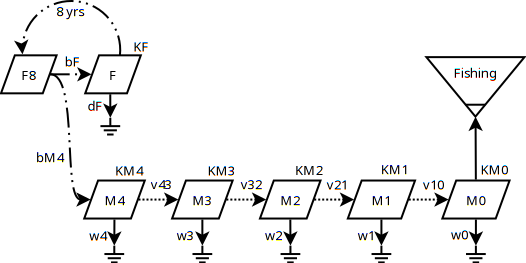

**A compartmental delay differential model of snow crab population dynamics in the Scotian Shelf of Atlantic Canada** \

Choi, Jae S.\
Population Ecology Division\
Department of Fisheries and Oceans\
Bedford Institute of Oceanography\
P.O. Box 1006, Dartmouth, Nova Scotia B2Y 4A2\

Abstract 

Snow crab life history

Snow crab have a complex life history. This complexity causes
spatiotemporal complexity in their abundance distributions and so is the
primary cause of the analytical difficulties of *spatiotemporal
aggregation*. They are, first and foremost, cold-water *stenotherms*. In
the Maritimes region, commercially fished snow crab are generally
observed between depths of 50 to 300 m and between temperatures of -1 to
7${^\circ}C$. Snow crab are thought to avoid temperatures above
7${^\circ}C$, as metabolic costs have been shown to match metabolic
gains near this temperature (Foyle et al. 1989). This means that their
spatial distributions can fluctuate seasonally and annually due to the
thermally complex nature of the Maritimes Region. Smaller crab and
females also have differences in thermal *preferenda*. Further, snow
crab are generally observed on soft mud bottoms. Small-bodied and
moulting crabs are also found on more complex (boulder, cobble)
substrates presumably as they afford more shelter (Sainte-Marie and
Hazel 1992; Comeau et al. 1998). There are of course many other factors
that regulate their distributions and local densities (discussed below).
The end result of these interactions is that their environmental niche
will vary depending upon the time of year and location.

Snow crab eggs are brooded by their mothers for up to two years. This
also depends directly upon ambient temperatures as well as food
availability (which also depends upon temperature via primary and
secondary production) and the health condition and maturity status of
the mother (up to 27 months in primiparous females -- first breeding
event; and up to 24 months in multiparous females -- second or possibly
third breeding events; Sainte-Marie 1993). More rapid development of
eggs (from 12 to 18 months) has been observed in other systems (Elner
and Beninger 1995; Webb et al. 2007). Over 80% of the female snow crab
on the Scotian Shelf are estimated to follow an annual, rather than the
bi-annual cycle possibly due to exposure to warmer temperatures (Kuhn
and Choi 2011). A primiparous female of approximately 57.4 mm carapace
width produces between 35,000 to 46,000 eggs, which are extruded between
February and April (Sainte-Marie 1993). Multiparous females are thought
to be more fecund, with more than 100,000 eggs being produced by each
female. Eggs are hatched from April to June when larvae are released.
This pelagic larval stage lasts for three to five months (zoea stages 1
and 2) during which snow crab feed upon zooplankton. Pelagic stages seem
to have highest abundance in October and so may begin settling in
January. Thereafter, they settle closer to the bottom in their megalopea
stage. Very little is known of survival rates at these early life
stages, but these also are thought to depend highly upon temperature.

 

Figure XX. Life history patterns of snow crab. Top: the timing of the main 
life history stages of snow crab. Bottom, the growth stanzas of the male 
component and decision paths to maturity and terminal moult.{#fig:Lifehistory}

Historical approach

The focus of the snow crab fishery has been upon the exploited 
fraction (Fig \ref{#fig:Lifehistory}), in isolation. A simple biomass 
dynamics model $b_{t+1}=r \cdot b_t(1-b_t/K)$ was used to estimate two 
biological parameters, the intrinsic rate of increase (r) and carrying 
capacity (K). These are the minimal parameters required to estimate 
biological reference points; and the relative distance from such 
reference points help delimit  the status of a population 
(*add references*). Currently such refrence points help to guide the implementation of the Precautionary Approach for fishery exploitation. A Bayesian approach to parameter estimation is used where informative priors for these parameters facilitate parameter estimates that are credible (*add* *references*). Previously, JAGS (Just Another Gibbs Sampler; *reference*) and STAN (reference) have been used to compute the posteriors via MCMC. The latter uses the more efficient NUTS sampler which significantly speeds up the estimation process.

The estimation approach was to use a discrete form of the biomass dynamics ("process") model, using the following priors:

$r \sim N(1, 0.1)$
$K \sim N(\mu, 0.1 * \mu)$.

The prior mean of the carrying capacity ($\mu$) were based upon prior historical analyses (*add references).* 

A simple observation model was used to relate the latent (unobserved) biomass process  ($b_t$)  to observations ($Y_t$) at a given year ($t$), by a linear scaling coefficient $(q)$, often referred to as a "catchability" coefficient and a Gaussian observation error ($\sigma_o$):

$b_t \sim N(b_t^*, \sigma_p)$.
$Y_t \sim N(q \cdot b_t, \sigma_o)$.

The latent biomass process was assumed to have a mean $(b^*_t)$ and Gaussian process error  $(\sigma_p)$. Values such as Maximum sustainable yield $(\text{MSY} = rK/4)$ and the fishing mortality associated with such a yield  $(\text{FMSY}=2*\text{MSY}/\exp(K)=rK/2\exp(K))$ help delimit the reference points to determine the scale of fishery exploitation. 

The strength of this approach is its simplicity; but this simplicity is also its primary weakness.

More specifically, the above model is phenomenological. That is, the logistic model is an heuristic model without mechanism, where biomass creates biomass at a constant exponential rate (r) to a limit of K. In the case of how it is applied with snow crab, there is a definite mechanistic problem if one only focusses upon the green line in Fig (\ref{#fig:Lifehistory}). Fishable biomass in one year does not operate in isolation upon itself to create fishable biomass in the next year, at a constant exponential rate. Instead, a certain number of fishable crab die from various causes (predation, disease, competitive fighting), a certain number of recruits terminally moult to a size in the fishable range to increase their numbers, they grow in weight as they eat, some fraction move in and out of a given area, and some are fished. Fundamentally it is a numerical process. As such, the biomass dynamics model simply implies that biomass in one year is related to the biomass in previous year with constraints that are only diffusely/indirectly related to these mechanistic processes.  It is, therefore, in practice, akin to a constained regression problem. These constaints being that the annual increment in biomass occurs as a second-order Taylor-series expansion with fishery landings, and some static upper bound (K). 

These constraints unfortunately result in a model that is not responsive enough to large fluctations in dynamics caused by extrinsic factors. Most notabily, there was an extreme warming event in 2021 that altered and constricted the spatial distribution of snow crab. The biomass dynamics model is too simple to express such external perturbations. This simplistic approach is most useful when the signal to noise ratio of a data timeseries is low, such as when there are very few data points across time and minimal information of other dynamical drivers and mostly driven by intrinsic dynamical factors. In the snow crab assessment, we have crossed a threshold in the number of years for which we have data that now permits us to say that at least two biological cycles have completed. A biological cycle for snow crab requires 8 to 13 years to complete. As such, we can now begin to contemplate estimating parameters based upon a more mechanistic model that can incorporate extrinsic factors and stage structure. This mechanistic understanding is possible only if we shift the focus to numbers and numerical density and the stage-based nature of the snow crab's life cycle. This necessitates conversion of numbers to biomass as the fishery operates upon biomass and not number.

For such a purpose, we consider the following simplified six-compartment model:

The F indicate all mature females of instar 9+, determined from size range and maturity. There is approximately an 8+ year period required for these females to produce the next generation of instar 9+ females. This is represented by the compartment 'F8'. A similar amount of time is required to produce males of instar 9 (denoted M4). Subsequently, instar 9 males transition to instar 10 (M3) and then to instar 11 (M2) and instar 12 (M1). M0 are considered fishable biomass (mature, > 95mm CW). A (small) fraction of instar 11 crab (M2) will be large enough to be considered legally fishable size whereas all instar 12 (M1) and greater will be considered fishable size. M1, therefore, represents a composite group of all crab that have entered fishable size but are still immature. Some fraction of this group will mature into the fishable component (M0) in the next year. Others will continue to moult to instar 13 and higher, but for our purposes, they will be considered M0 only if they are morphologically mature. The numeric indices for males, therefore, indicate an approximate time in years before entry into the fishable component. The first two transition rates are akin to a birth rate (b) where the bounds in the rate are determined by egg production and survival to instar 9 (approximately 40 to 60 mm CW). The latter four are first order transition probability rates (v) that are bound by definition to be in the range (0 to 1).

The rationale for modelling to instar 9+ is that survey sampling and estimation is still mostly reliable at this size range (40 to 60 mm CW). Earlier instars tend to have more divergent habitat preferences relative to those of the fishable component and so sampling bias becomes problematic as the snow crab surveys are optimzed for the latter. The advantage of these additional compartments is that they also permit more stable parameter estimation and forwrd projection.

Each compartment has associated death rates akin to the logistic formulation that increases when $n \rightarrow K$ and declines when $n \rightarrow 0$. The  term $n / K$ found in the logistic model encapsulates this behaviour such that  mortality rate = $w \cdot n \cdot (n / K ).$ Thus when  $n \rightarrow K$, the mortality rate $\rightarrow w \cdot n$ (i.e., a first order rate process), and when  $n \rightarrow 0$, it declines exponentially (i.e., a second order rate process).

Here, K is actually not a constant but an externally driven parameter $K_t$, the carrying capacity after adjustment for viable habitat surface area variations $(H_t$) across time: $K_t = K_\text{constant} \cdot H_t$. 

The full set of delay differential equations are therefore: 

$dM0/dt = v_{10} \cdot M1_{t-1} - w_{M0} \cdot M0 \cdot (M0 /  K_{M0,t}  ) - \text{Landings}_t$ 
$dM1/dt = v_{21} \cdot M2_{t-1} - v_{10} \cdot M1_{t-1} - w_{M1} \cdot M1 \cdot (M1 / K_{M1,t} )$ 
$dM2/dt = v_{32} \cdot M3_{t-1} - v_{21} \cdot M2_{t-1} - w_{M2} \cdot M2 \cdot (M2 / K_{M2, t} )$ 
$dM3/dt = v_{43} \cdot M4_{t-1} - v_{32} \cdot M3_{t-1} - w_{M3} \cdot M3 \cdot (M3 / K_{M3,t} )$ 
$dM4/dt = b_{M4} \cdot F_{t-8} - v_{43} \cdot M4_{t-1} - w_{M4} \cdot M4 \cdot (M4 / K_{M4,t} )$ 
$dF/dt = b_F \cdot F_{t-8} - w_F \cdot F \cdot (F /  K_{F,t} )$

Fishery landings were converted to number based upon annual average weight of the fishable component and, discretized to 10 time intervals within each year. The latter was to avoid strong discontinuities to facillitate Bayesian estimations procedures (NUTS, No-U-Turn-Sampler) that relies upon automatic differentiation to speed up computations.  Delay differential modelling was conducted using the DifferentialEquations library from Julia (reference) and Posterior estimates of parameters given the data were infered using the Turing library, also from Julia. 

s
